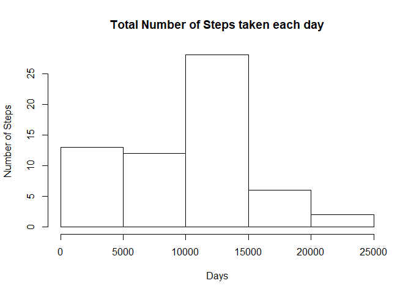
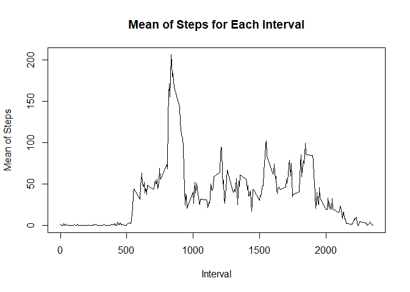
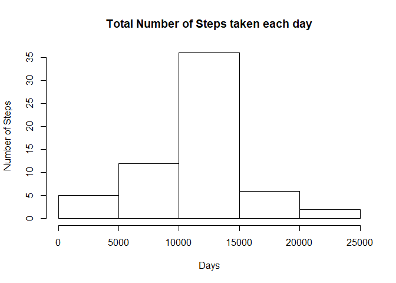

## Loading and preprocessing the data

```r
if(!file.exists('activity.csv')){
  unzip('activity.zip')
}

steps_data<-read.csv('activity.csv')
```


## What is mean total number of steps taken per day?

```r
##Convert dates to date class
steps_data$date<-as.Date(steps_data$date,"%Y-%m-%d")

##Sum by date
steps_per_day<-aggregate(steps_data$steps,by=list(date=steps_data$date),FUN=sum,na.rm=TRUE)

##Draw a histogram
hist(steps_per_day$x,main="Total Number of Steps taken each day",xlab="Days",ylab="Number of Steps")
```

<!-- -->

```r
##Calculate Mean
steps_per_day_mean<-mean(steps_per_day$x)

##Calculate Median
steps_per_day_median<-median(steps_per_day$x)
```

Mean number of steps per day: `9354.2295082`

Median number of steps per day: `10395`

## What is the average daily activity pattern?

```r
##Calculate mean for each interval
steps_per_interval_mean<-aggregate(steps_data,by=list(interval=steps_data$interval),FUN=mean,na.rm=TRUE)

#Time series plot
plot(steps_per_interval_mean$interval,steps_per_interval_mean$steps,type="l",main = "Mean of Steps for Each Interval",xlab = "Interval",ylab = "Mean of Steps")
```

<!-- -->

```r
##Find the interval with the maximum number of steps
max_interval<-(steps_per_interval_mean[which.max(steps_per_interval_mean$steps),])$interval
```

Interval `835`,on average across all the days in the data set, contains the maximum number of steps

## Imputing missing values


```r
##Total number of missing values
num_missing<-sum(is.na(steps_data$steps))
```

Number of missing values: `2304`

The strategy I would use to fill missing values is via mean steps for intervals.


```r
##Use mean steps for the interval to fill missing values

#Make a copy of the steps data
steps_data_imputed<-steps_data

##Find steps with value as NA and replace with the mean value for the interval calculated above.
for(i in 1:length(steps_data_imputed$steps)){
  if(is.na(steps_data_imputed$steps[i])){
    steps_data_imputed$steps[i]<-steps_per_interval_mean$steps[which(steps_per_interval_mean$interval==steps_data_imputed$interval[i])]
  }
}

##Sum by date
steps_imputed_per_day<-aggregate(steps_data_imputed$steps,by=list(date=steps_data$date),FUN=sum,na.rm=TRUE)

##Draw a histogram
hist(as.numeric(steps_imputed_per_day$x),main="Total Number of Steps taken each day",xlab="Days",ylab="Number of Steps")
```

<!-- -->

```r
##Calculate Mean
steps_imputed_per_day_mean<-mean(steps_imputed_per_day$x)

##Calculate Median
steps_imputed_per_day_median<-median(steps_imputed_per_day$x)
```

Mean number of steps per day (after filling missing values): `1.0766189\times 10^{4}`

Median number of steps per day (after filling missing values): `1.0766189\times 10^{4}`

As can be observed above, the impact of imputing missing data on the estimates of the total daily number of steps is that it brings the median closer and equivalent to the mean.

## Are there differences in activity patterns between weekdays and weekends?

```r
library(ggplot2)
```

```
## Warning: package 'ggplot2' was built under R version 3.6.3
```

```r
#Assign a Weekday or Weekend tag to each row based on the date.
for(j in 1:length(steps_data_imputed$steps)){
  if(weekdays(steps_data_imputed$date[j])=="Saturday" || weekdays(steps_data_imputed$date[j])=="Sunday"){
    steps_data_imputed$wkdorwknd[j]="Weekend"
  }else{
    steps_data_imputed$wkdorwknd[j]="Weekday"
  }
}

steps_data_imputed$wkdorwknd<-as.factor(steps_data_imputed$wkdorwknd)

#Take the mean of the steps for each interval categorized by weekday/weekend.
steps_imputed_per_interval_wkdorwknd<-aggregate(steps_data_imputed$steps,by=list(wkdorwknd=steps_data_imputed$wkdorwknd,interval=steps_data_imputed$interval),FUN=mean,na.rm=TRUE)

#Provide data to ggplot including the values for x,y axis
wkd_wknd_plot<-ggplot(steps_imputed_per_interval_wkdorwknd,aes(x=factor(interval),y=x,group=1))

#Specify the plot type - line graph
wkd_wknd_plot<-wkd_wknd_plot+geom_line()

#Create a column of 2 plots - one for each weekday and weekend
wkd_wknd_plot<-wkd_wknd_plot+facet_grid(wkdorwknd~.)

#Space out the x-axis scale
wkd_wknd_plot<-wkd_wknd_plot+scale_x_discrete(breaks=seq(0,2400,by=200))

#Add x and y axis labels
wkd_wknd_plot<-wkd_wknd_plot+xlab("Interval")+ylab("Mean Steps")

#Add plot title
wkd_wknd_plot<-wkd_wknd_plot+ggtitle("Total Number of Steps by Interval")

print(wkd_wknd_plot)
```

<!-- -->

Based on the two plots above, it seems during the morning hours on a weekday the step activity is higher than during the same hours on a weekend. However, the number of steps taken on the weekend seems to be more than those taken on a weekday possibly due to more recreational activities on a weekend.
